# Xiao Shua's 3D Editor

## Deployed at : xiaoshua3d.vercel.app

A browser-based 3D editor built around one gesture: **drop a 2D shape onto a solid, then push or pull it perpendicular to the surface.**

[Open the editor](https://xiaoshua3d.vercel.app) · [Getting started](#getting-started) · [Features in full](docs/features.md) · [Design notes](docs/design.md)


Existing 3D editors demand a lot of tool-specific knowledge before you can make a single change. This one starts you with an empty grid, a palette of ten primitives and a palette of 2D shapes. Drag a cube into the scene, drop a circle onto it, slide it around, set a depth, and it becomes a boss or a pocket. No modes, no sketch-plane ceremony.

## Contents

- [Three benches](#three-benches)
  - [Modelling](#modelling)
  - [Lathe](#lathe)
  - [Laser Cutter](#laser-cutter)
- [Projects, help and settings](#projects-help-and-settings)
- [Themes](#themes)
- [Stack](#stack)
- [Getting started](#getting-started)
- [Verification](#verification)
- [Layout](#layout)
- [Known limits](#known-limits)
- [Design notes](#design-notes)

## Three benches

The tabs at the left of the bar pick a screen. A screen is a viewport and the console that drives it, chosen together: **Modelling** is the editor, **Lathe** turns one lump of clay, and **Laser Cutter** is a bench with one block of stock on it. Everything in the bar that acts on a scene dims on a screen that has none, rather than disappearing, and what you make on the lathe or the cutter reaches the modelling scene through the Clipboard.

### Modelling

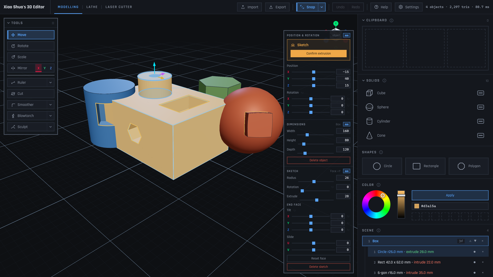

- **Drop** solids from the palette: cube, sphere, cylinder, cone, pyramid, prism, bean, tetrahedron, octahedron, dodecahedron. Pyramids and prisms take 3, 4, 5, 6 or 8 sides, chosen by sweeping across the palette row.
- **Sketch** a circle, rectangle or polygon onto any face, flat or curved, then **extrude** it with one signed depth. Positive adds a boss, negative cuts a pocket, and a pocket deeper than the wall is a hole. The created end face can be tilted and slid while the base stays welded to the host.
- **Aim** with the gizmo. Three arrows and a ring: left-drag an arrow to slide, right-drag it to resize along that axis, drag the ring to scale, right-drag it to turn with a detent at every 45 degrees. Hold Control for plane handles.
- **Snap** corners, edges and faces flush with other objects while dragging, so two solids go flush rather than nearly flush.
- **Cut** with a plane and keep both halves live. **Mirror** in place along any axis. **Merge** any number of objects into one, keeping every colour that went in. **Erase** with any primitive, confirmed in one step.
- **Melt** with the blowtorch, **raise** with the sculpt brush and **round** edges with the smoother. All three share one brush pipeline; the torch burns through thin walls into a real tunnel.
- **Measure** with rulers whose ends snap to geometry. **Colour** the selection from a hue ring, a brightness slider or a hex field.
- **Import** and **export** `.glb`, `.obj`, `.stl` and `.step`. STEP is rebuilt as a B-rep solid with shared edges, so it opens in SolidWorks, Fusion or FreeCAD as a body you can measure, cut and fillet.

<table>
  <tr>
    <td width="33%">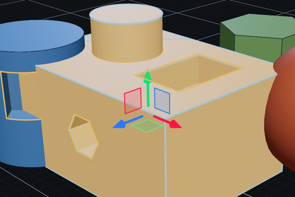</td>
    <td width="33%">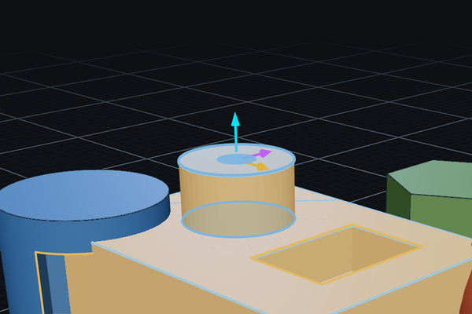</td>
    <td width="33%">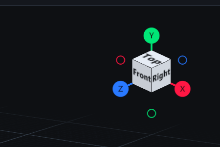</td>
  </tr>
  <tr>
    <td>Object gizmo. Arrows slide or resize, the ring scales or turns.</td>
    <td>Sketch gizmo. Two arrows slide across the surface, the third pushes or pulls.</td>
    <td>Compass. Click a ball or a face to fly there, or drag it to orbit.</td>
  </tr>
</table>

| Gesture | Does |
| --- | --- |
| Left-drag an arrow | Slides along that axis, snapping as it goes |
| Right-drag the same arrow | Resizes along that axis |
| Drag the ring | Scales every dimension at once |
| Right-drag the ring | Turns about the axis nearest the camera, holding at every 45 degrees |
| Hold Control, drag a plane | Slides within that plane |
| Left-drag from empty space | Draws a selection box; Shift adds to the selection |
| Middle-drag, or Alt and left-drag | Orbits the camera; right-drag pans, the wheel zooms |
| Ctrl+C, Ctrl+V | Copies and pastes the selected object |
| Ctrl+Z, Ctrl+Shift+Z | Undo and redo, on whichever screen is up |
| Delete | Removes the selected sketch, ruler or object |

### Lathe

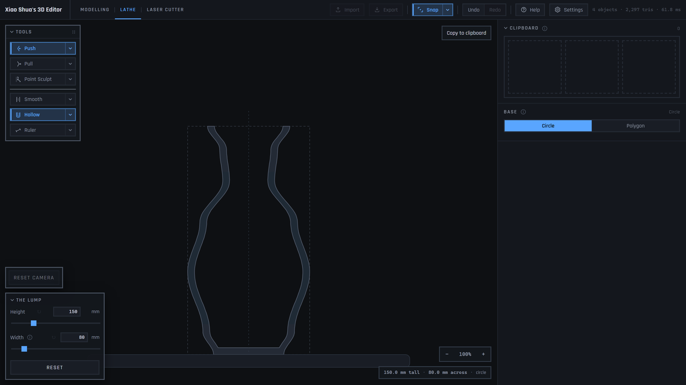

- A lump of clay, drawn from the side as one profile. **Push** takes material away and **Pull** adds it. The wall travels to the pointer and stops there, so where you hold is where the wall ends up and a slip cannot gouge.
- **Smooth** fairs out the ripples a hard push leaves. **Point Sculpt** drops points down the side and runs a line or a fitted curve through them; it is the one tool on the screen that can leave a corner.
- **Hollow** with a wall thickness and a choice of open or closed ends: closed underneath and open on top is a cup, open at both ends is a pipe, closed at both is a sealed void. The viewport draws the piece in section so the bore is visible while you work.
- Turn the piece on a **circle** or on a polygon from a triangle to a decagon. Every base shares the same profile; the solid that leaves is a cylinder body, a hexagonal prism, a triangular one.
- **Copy to clipboard** sweeps the profile a full turn into a real solid, ready to paste into the modelling scene and be cut, mirrored, melted or exported like anything else.

### Laser Cutter

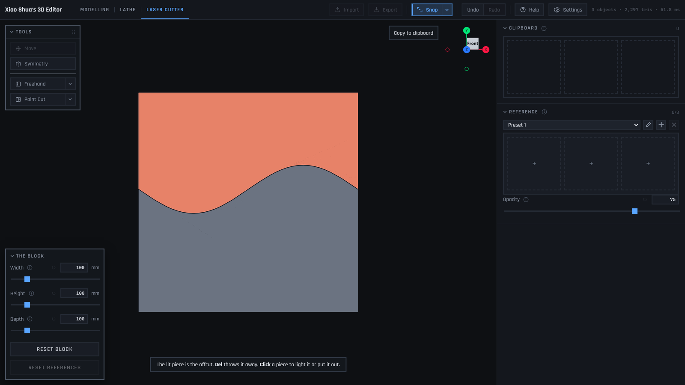

- One block of stock stands on the bed and cannot be moved. The compass is the only thing that turns the view, and it settles square on to whichever of the six faces it is nearest every time you let go, so what is on screen is a true picture of one face.
- **Freehand** drags a line out behind the pointer on a length of rope, so a tremor inside the slack moves nothing. **Point Cut** places the line a point at a time: straight segments, a fitted curve, or a curve with a handle on every point.
- Both ends of a line are carried to the border along their own tangent, so a stroke across a tenth of the face still separates the block. **Apply** burns through the whole block at once. The offcut is lit; **Del** throws it away.
- **Symmetry** stands a mirror through the middle of the face, at any angle or as a cross, and burns every copy in one act.
- **Reference** images pin to a face at a chosen opacity, so a drawing can be traced.

## Projects, help and settings

<table>
  <tr>
    <td width="50%">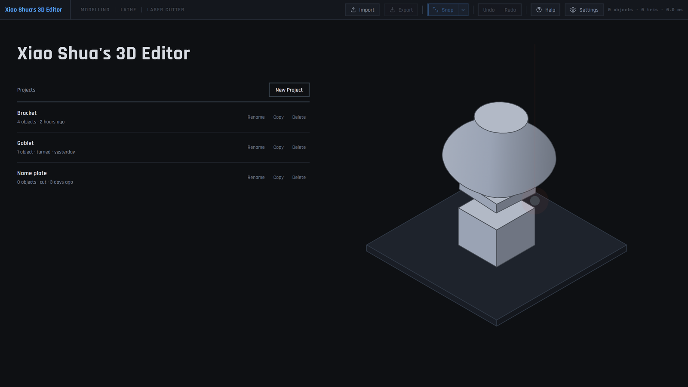</td>
    <td width="50%">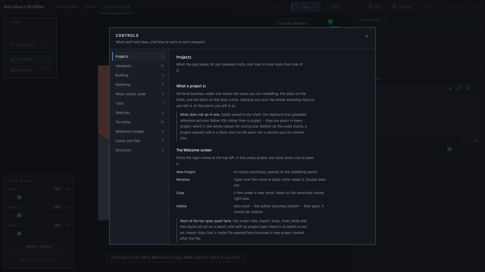</td>
  </tr>
  <tr>
    <td>A project is all three benches under one name, saved in the browser and opened back at the bench you left.</td>
    <td>Help is a document with a section per tool. A control in the interface is a name and the control itself; the explaining lives here.</td>
  </tr>
</table>

Settings hold the few things that are true of every project: whether the app opens at the welcome screen or the last project, the display unit, the theme, outlines, motion and game controls.

## Themes

<table>
  <tr>
    <td width="33%">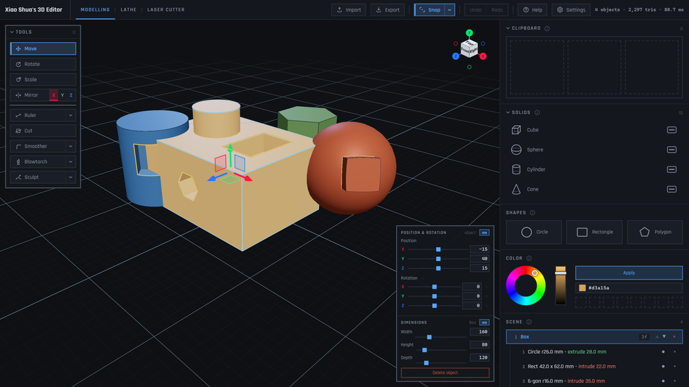</td>
    <td width="33%">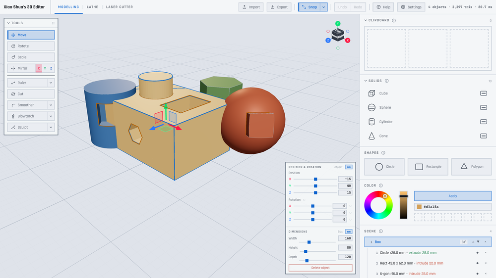</td>
    <td width="33%">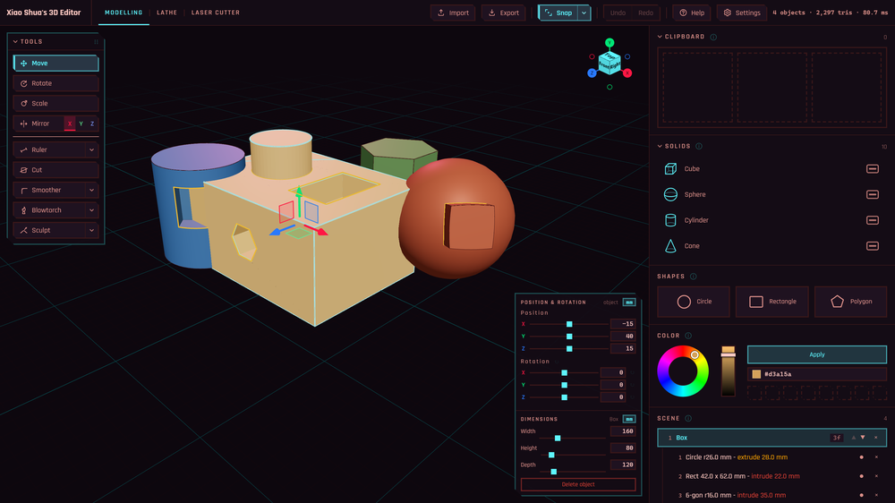</td>
  </tr>
  <tr>
    <td>Dark</td>
    <td>Light</td>
    <td>Cyberpunk</td>
  </tr>
</table>

## Stack

React 19 · TypeScript · Vite · three.js · @react-three/fiber and drei · three-bvh-csg · zustand

## Getting started

```bash
npm install
npm run dev      # http://localhost:5173
```

| Script | Purpose |
| --- | --- |
| `npm run dev` | Vite dev server |
| `npm run build` | Typecheck and production build |
| `npm run typecheck` | Types only, `src` **and** the check suites |
| `npm run check` | Headless geometry, interaction, console, export, import and persistence suites |
| `npx tsx scripts/sample-export.ts [dir]` | Write sample `.glb` / `.obj` / `.stl` / `.step` files |
| `npx tsx scripts/palette-preview.ts [file]` | Standalone preview of the console palettes |

## Verification

The engine *and* the console are verified headlessly, without a browser: **4,818 assertions** across six suites, none of which settle for "something is truthy". A geometry assertion quotes the number it got beside the number it wanted; a console assertion quotes the markup it found.

| Suite | Assertions | Covers |
| --- | ---: | --- |
| Geometry | 794 | Booleans, primitives, cuts, mirrors, the brush and the lathe, each against an analytic answer |
| Interaction | 691 | Picking, snapping, the gizmo's drag resolvers and the compass views |
| Console | 3,071 | The bar and every panel, rendered against real store state through a full editing session |
| Export | 85 | GLB, OBJ, STL and STEP written and read back, topology walked entity by entity |
| Import | 90 | Meshes and STEP files landing as sized, placed solids |
| Persistence | 87 | Projects written to the browser and read back, with every corrupt record refused rather than opened |

The main instrument is **signed volume via the divergence theorem**: for a closed, consistently wound mesh it returns the true enclosed volume, so one number proves both that a boolean produced the right amount of material *and* that the result is watertight. A leaking or inside-out mesh cannot accidentally land on the analytic answer.

```
cube + circular boss    8.0846  vs analytic 8.0848
cube - circular pocket  7.9154  vs analytic 7.9152
cube - through hole     7.4361  vs analytic 7.4345
sphere boss top         every vertex at radius 1.2500, spread 2.47e-3
GLB round-trip          export, reload, recompute: 8.0846
STL round-trip          export, reload, recompute: 8.0846
STEP topology           cube + boss: 1 solid, 55 faces, every edge
                        walked by exactly two of them, once each way
```

The full account of what each suite checks, and how, is in [docs/verification.md](docs/verification.md).

## Layout

```
src/
  App.tsx        which viewport and console each screen mounts
  screens.ts     the table of screens, free of React
  geometry/      the engine: solids, surfaces, prism, evaluate, cut, mirror,
                 erode, clay, revolve, laserCut, brep, step, exporters, importers
  store/         docStore (scene + undo), toolStore, latheStore, laserStore,
                 libraryStore, projectStore
  viewport/      the three viewports, the gizmos, the compass, picking,
                 snapping, rulers and the brushes
  console/       the bar, the three consoles and their panels, the welcome,
                 help and settings screens
scripts/         headless check suites and preview generators
docs/            screenshots and the long-form notes linked from this file
```

## Known limits

- Sketches on faces created by earlier features use a locally-flat approximation; base-primitive surfaces get the exact treatment.
- Outlines must be convex, and pocket depth on a sphere is capped short of the centre.
- STEP faces are planar: a round hole arrives as a polygon, and STEP import reads the planar faces and skips the curved ones, reporting what it left out.
- An imported model has no history. A round trip through export and import is lossless in geometry and lossy in editability.
- Export bakes the whole scene into one mesh with one material, so a scene of differently coloured objects exports as a single grey model.
- The Clipboard is session-scoped; saved objects survive every edit and undo, but not a reload.
- A merged object sizes uniformly rather than per axis, and there is no unmerge.
- The blowtorch will not burn through at the very rim of a panel; aim a brush-width in and it goes straight through.

The full list, with the reason behind each, is in [docs/known-limits.md](docs/known-limits.md).

## Design notes

The decisions behind the editor are written up in [docs/design.md](docs/design.md):

- [The document](docs/design.md#the-document): a scene of parametric objects whose meshes are always derived, so a merge, a cut, a mirror or an eraser destroys nothing it does not mean to.
- [The gizmo](docs/design.md#the-gizmo): why the plane handles replace the ring, why a hidden handle must stand down, and how a turn holds at 45 degrees.
- [The compass](docs/design.md#the-compass): a second canvas with its own orthographic camera, a readout that is also a control.
- [Where a control lives](docs/design.md#where-a-control-lives): the bar, the island, the console and the corner panel, and what belongs in each.
- [Curved surfaces](docs/design.md#curved-surfaces): one ring of surface points and normals, from which flat and radial extrusion both fall out.
