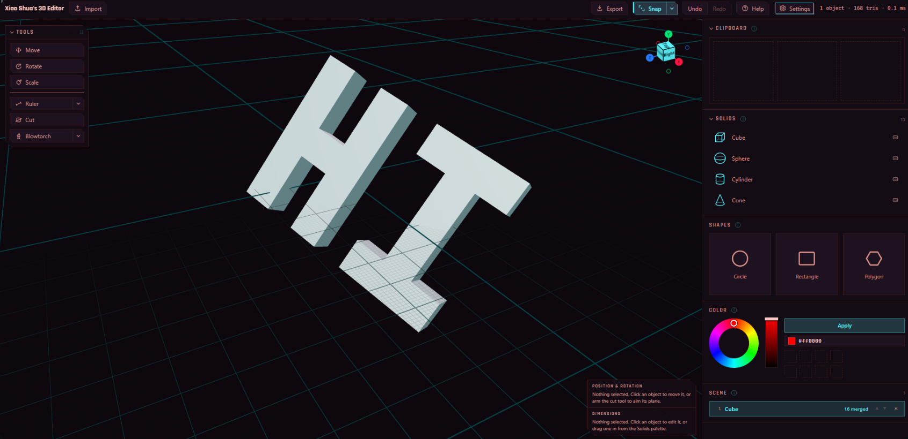

# Xiao Shua's 3D Editor

A 3D editor built around one gesture: **drop a 2D shape onto a solid, then push or pull it perpendicular to the surface.**



Existing 3D editors demand a lot of tool-specific knowledge before you can make a single change. This one starts you with an empty grid, a palette of ten primitives and a palette of 2D shapes. Drag a cube into the scene, drop a circle onto it, slide it around, set a depth, and it becomes a boss or a pocket. No modes, no sketch-plane ceremony.

---
Deployed at:
https://xiaoshua3d.vercel.app
---

## What it does

- **Switch screens** from the tabs at the left of the top bar. A screen is a viewport and the console that drives it, chosen together: **Modelling** is the editor everything below describes, **Lathe** is a screen of its own for turning one lump of clay, and **Laser Cutter** is a bench with one block of stock on it. Everything in the bar that acts on the scene dims on a screen that has none, rather than disappearing.
- **Turn** a piece on the **Lathe** screen: a lump of clay, drawn from the side, shaped by holding **Push** or **Pull** against its wall. Push is in hand when the screen opens; it takes material away and Pull adds it; the wall travels to the pointer and stops there, so where you hold is where the wall ends up and holding longer only finishes the curve. A panel in the bottom-left corner sets the stock's height and width, and changing either carries the shape with it.
- **Choose the base** the piece is turned on from the lathe console: a **circle**, or a **polygon** from a triangle to a decagon. Every base has the same profile -- a hexagonal piece and a round one are the same shape from the side -- so the drawing does not change, but the solid that leaves does: a cylinder body, a hexagonal prism, a triangular one. The fainter dashed line inside the piece is where the flats run; the wall you push and pull is the line the corners follow. It can be picked at any point, and moves no part of the wall.
- **Smooth** a stretch of wall with the third tool on the island: it neither adds nor takes away, it fairs out the ripples a hard push leaves. Only the height you hold it at matters, since there is nothing to aim at.
- **Point Sculpt** the profile instead of pushing it: click beside the piece to drop points down its side, and the line through them becomes the wall over the span they cover. **Fit to line** runs a smooth curve through every point, each with a handle you may aim -- aim one and it stays yours while the rest go on being fitted; turn it off and the points are joined with straight segments, which is how you get a square shoulder or a chamfer. It is the only tool on this screen that can leave a CORNER: the three brushes all fair the wall as they work it, so a step pushed by hand rounds itself off. Only the span the points cover is touched, so a foot can be re-cut on a piece whose belly is already right, and **Apply profile** is one undo step.
- **Hollow** the piece from the tool at the foot of the island: set a **wall thickness** and say for each end whether it is closed or open. Closed underneath and open on top is a cup, open at both is a pipe, closed at both is a sealed void, open underneath is a bell. The inside is the outside offset inward, so shaping afterwards thins the wall with it -- and the viewport draws the piece in section, so you can see the bore while you work.
- **Undo on the lathe** with Ctrl+Z, or the bar's own buttons, which now walk whichever screen is up. One stroke is one step however long you held the tool down; Reset is one step as well.
- **Copy to clipboard** from the lathe's top-right corner: the piece is swept a full turn into a real solid and lands on the Clipboard shelf, ready to paste into the modelling scene and be cut, mirrored, melted or exported like anything else.
- **Pick a face** on the **Laser Cutter** screen. One block of stock stands on the bed and cannot be moved; the compass in the corner is the only thing that turns the view, and it comes to rest square on to whichever of the six faces it is nearest every time you let go of it -- so what is on screen is a square picture of one face rather than a view leaning at some angle nobody chose. Clicking a ball or a face flies there directly. The wheel zooms, which cannot tip the view off a face; there is no orbit and no pan. A panel in the bottom-left corner sets the block's side, and it grows from its own footprint against a camera that stays put, so a bigger block really does look bigger. The tools island is here and empty: nothing cuts yet.
- **Cut the block** with either of the Laser Cutter's two tools, both of which draw one line on the face you are square on to. **Freehand** drags the line out by hand, pulled along behind the pointer on a length of rope so a tremor inside the slack moves nothing -- what is recorded is where the tool went, not where the hand went, so the line you see is the line that gets cut. **Point Cut** places the line a point at a time, and reads those points three ways: **Straight** joins them with segments, **Fit to line** runs a smooth curve through every one of them, and **Manual** is that same curve with a handle on each point to aim it, the two ends of a handle staying opposite so the line never kinks. Both ends of any line are carried on to the border along their own tangent, so a stroke across a tenth of the face still separates the block.
- **Apply the cut** and it burns through the whole block at once. The pieces stay exactly where the block was, one kerf apart, and the piece the cut sheared off smallest is lit: **Del** throws it away, so does **Discard offcut**, and **Auto discard** does it on every cut without the press. Cuts are baked rather than kept as a list -- **Ctrl+Z** is the way back and one cut is one step -- and a later cut acts on every piece its line crosses. Turning the compass to another face clears whatever you were drawing, because a line belongs to the face it was drawn on.
- **Drop** solids into the scene: cube, sphere, cylinder, cone, pyramid, prism, bean, tetrahedron, octahedron, dodecahedron. Pyramids and prisms take 3/4/5/6/8 sides.
- **Place** them by dragging: a ghost follows the ground plane and the object lands resting on the grid. Hold Shift while moving one to lift it instead.
- **Snap** corners, edges and faces to other objects while you drag, so two solids go flush rather than nearly flush.
- **Aim** with a gizmo: three coloured arrows and a ring on the selected object. Left-drag an arrow to slide along that axis, right-drag the same arrow to resize along it, drag the ring to scale the whole solid.
- **Hold Control** and the ring gives way to three plane handles -- XY, XZ and YZ -- and dragging one slides the target *within* that plane. Sliding something across the ground or down the face of a wall is one gesture rather than two aimed at directions.
- **Drop** a circle, rectangle, or polygon (3/4/5/6/8/10 sides) onto *any* object
- **Slide** it across the surface and resize it, before or after extruding
- **Extrude** perpendicular to the surface at that point: one signed depth, positive out and negative in, so a boss and a pocket are the two ends of one slider
- **Push or pull** it in the viewport instead, from the sketch gizmo's third arrow -- the one facing away from the face
- **Lean** the created end face: tilt its plane on XYZ and slide it within that plane. The base of the extrusion stays welded to the host and the pillar follows.
- **Measure** with rulers: a 50 mm line with a moveable end at each side, and the distance it spans printed on the middle of it. The ends snap to corners, edges and faces like anything else you drag, so corner-to-corner is exact rather than nearly. Lay down as many as you like -- the selected one wears yellow-and-black stripes and carries the arrows, the rest stay thin yellow lines.
- **Cut** with a plane you place with that same gizmo and tilt by XYZ. Each half stays a live parametric object, base and features intact.
- **Mirror** the selected solid along one of its own axes. The Mirror tool's button holds three small **X**, **Y** and **Z** buttons, coloured to match the gizmo's arrows; press one and the object flips in place, about the plane through its own centre. Everything on it goes with it -- sketches land at the mirror image of where they sat, cuts, torch marks and welded parts too -- and pressing the same axis twice puts it back exactly.
- **Melt** with the **blowtorch**: drag it across a solid and the surface under the brush sinks *and flows*, so edges round off and the mark blends into the face rather than being a bite out of it. Not a boolean -- subtracting a sphere leaves a drill hole with a crisp rim, and this leaves a dish. Brush size, Heat and Smoothing are behind its caret; a red ghost sphere shows where it would land. Held against a wall thinner than the brush it **burns through**: the surface sags until there is no wall left, and then a hole opens with a melted lip and widens toward the size of the brush, so a drag cuts a slot. The solid stays closed around it -- what used to happen instead was the near face sinking straight through the far one and standing inside out on the back of the panel.
- **Sculpt** with the same brush pointed the other way: drag and the surface *rises*, drawing material onto the object along the line you pull. It is the blowtorch with one sign flipped -- at the same three settings a bead stands exactly as proud as the torch's dish sinks -- and it wears green, the app's colour for material arriving. Arming any brush puts the others down. Neither of these two sharpens: on a sharp tip or a sharp inside corner, Smoothing rounds the feature off faster than either can push it.
- **Round corners off** with the **Smoother**, which sits next to Cut because a blade is what usually makes the arris you want gone. It is the same sphere with the bite taken out of it -- relaxation only -- and the one brush here that *arrives somewhere*. Two dials rather than three: **Brush size**, and **Strength**, which is the radius a corner is driven to as a share of that brush -- held to about a fifth either way, the residual depending on the brush against the object rather than on either alone. Drag along an edge and it eases into a fillet of that radius and then stops, so a second pass over the same edge leaves the same edge; to take more off you turn Strength up rather than keep scrubbing. It moves only what is sharper than the target, so a flat face under the brush does not move at all -- not approximately, exactly, since a vertex on a plane has its neighbours in that plane -- and a curve already gentler than the target is left alone for the same reason. Inside creases fill out to the radius that convex corners ease in to, being one signed measurement rather than two rules. It wears a cool neutral, since it neither adds material nor takes it away. On a rim thinner than twice the target the two rounds are aimed at the same material; rather than passing through each other they each spend a fifth of what is left per pass, so the rim comes out thin and rounded instead of inside out.
- **Stack** features - sketch on a face an earlier feature created
- **Orient** yourself with the compass in the top-right corner: the world's three axes as the camera sees them, with a labelled cube standing in the middle. Click any ball, stalk or face and the camera flies round to look from there, keeping the distance and the point it was orbiting. Or **drag** any part of it to orbit by hand -- half a turn across the widget, rotation only.
- **Select** several at once with a box: left-drag from empty space and everything whose gizmo falls inside is picked up as the box grows. Hold Shift to add its catch to what is already selected.
- **Erase** with any primitive. Drag the small grip at the right of a Solids row and the solid lands as a translucent red **eraser**: move it, turn it, resize it and snap it exactly as you would anything else, then confirm the subtraction in the block that appears at the top of Position & Rotation. A switch there decides whether it cuts everything it overlaps or only the objects picked out alongside it. Confirming is one way -- the eraser is spent and the hole has no handle left on it -- and one undo puts the whole thing back.
- **Merge** any number of objects into one. Shift-click or box-select to gather them, then Merge in the Scene section: they become a single object with a single gizmo.
- **Choose a base polygon** by sweeping across a Solids row: the row is split into invisible bands, one per side count, and the ticks under the name say where the sweep has got to. It is the polygon chip in Shapes, laid out sideways -- and it costs no width, which is what freed the right end of the row for the eraser grip.
- **Order** the scene: the list under Scene is a priority order, top to bottom, and every row carries a pair of arrows. Where two objects present the very same surface -- two overlapping solids severed by one cut plane, whose caps are then coplanar -- the higher one is drawn and the lower gives way.
- **Colour** what you have selected, from the Colour panel in the console: turn the hollow hue ring, raise or lower the brightness slider beside it, or type an exact `#rrggbb` into the hex field under Apply. Applying paints the selection and nothing else, in a single undo step however many objects it covers, and drops the colour onto a shelf of the last eight you used -- click one to load it back into the picker. Merging keeps every colour that went in, so one object can wear several; Apply aimed at such an assembly repaints all of it.
- **Copy** an object with Ctrl+C and **paste** it with Ctrl+V, or right-click it for the same two, plus **Save as custom object**.
- **Keep** what you build: saved objects land in the Clipboard panel as `Custom 1`, `Custom 2`... Rename them there, and drag a tile back into the scene to place a full copy -- sketches, cuts, merged parts and the rotation it was saved at.
- **Inspect** a saved object on its tile: each one is a live turntable seen from 30 degrees above, turning about the same point its gizmo sits on. Sweep the pointer across it to spin it a full revolution per tile width; vertical movement is ignored.
- **Import** a model from the bar beside the app's name: `.glb`, `.obj`, `.stl` or `.step` -- exactly the four formats Export writes, so the pair are Open and Save under other names. It lands as one solid resting on the grid, clear of whatever is already there, and from that moment it is an ordinary object: size it on all three axes, move it, turn it, snap it, cut it, colour it, merge it, sketch a boss or a pocket onto it, erase into it. A model too big or too small for the five-metre world is scaled uniformly to fit and the receipt says so.
- **Export** the whole scene as `.glb`, `.obj`, `.stl` or `.step`. The first three write the mesh you are looking at; **STEP** rebuilds it as a CAD solid -- flat faces with shared edges, holes as real inner boundaries -- so it opens in SolidWorks, Fusion or FreeCAD as a body you can measure, cut and fillet rather than as a heap of facets.

## The document

The document is a **scene of parametric objects**:

```
Doc          = { objects: SceneObject[] }
SceneObject  = { base, transform, features[], cuts[], parts[] }
```

Every object is a base solid plus any merged-in parts, plus an ordered feature list plus a list of retained half-spaces, and the mesh is always *derived* by replaying CSG over that list. Change a radius after extruding and the solid re-evaluates.

Two decisions make the scene cheap:

**Everything is object-local.** Primitives are centred on the origin and stand along +Y; anchors, features and cuts are all stored in the object's own space. The transform enters exactly once, on export. Dragging an object across the scene therefore costs no boolean work at all - and its sketches, its pockets and its cut faces all travel with it, undo included.

**A merge destroys nothing either.** Merged solids become `parts` inside their host -- each one a whole `SceneObject` in the host's local space, keeping its own base, features, cuts and even its own parts. Only its transform is rewritten, from world space into the host's, so it does not move a millimetre. The union is slot zero of the evaluator's prefix cache, so a merged object rebuilds its weld only when the merge changes, not when a feature on top of it is dragged. Recursion falls out of the shape: merging something that was itself merged nests rather than flattening.

**And it destroys no colours.** The union is one mesh, but it is a *grouped* one: every brush goes into the boolean under a stand-in material naming the solid it came from, and the evaluator carries those through, so the result arrives with one group per solid still showing a face. `ObjectEval.paints` is that list of ids, and the viewport gives each group a material of its own, looking the colour up in the document. Merging a red cube into a blue one therefore leaves an object that is still red and blue. The groups are keyed by **id rather than by colour** on purpose: repainting a solid then moves a material prop and re-runs no boolean at all, which is also why colour is stripped from the prefix cache's keys. New surfaces the assembly grows afterwards -- a pocket's walls, the face a cut exposes -- take the host object's own colour, since a feature belongs to the object rather than to any one solid inside it.

**An imported model is a base solid like any other, with its triangles kept outside the document.** A `mesh` base is `{ meshId, label, size }` -- a ticket, a name and three numbers -- and the vertices live in a module-level shelf that the ticket names. They have to: everything else the app draws is *derived* from the `Doc`, which is what makes the document cheap to diff, to clone and to key the evaluator's prefix cache on, and a hundred thousand vertices sitting in a base would be stringified once per evaluation. What is stored is normalised to a unit box centred on the origin, so `size` multiplies straight through and a mesh measures exactly the way a box does -- which is why the gizmo arrows, the Width/Height/Depth fields and the uniform-scale ring needed no case for it. Nothing is ever evicted from the shelf, because undo history points at it too: rewinding past an import has to bring the model back rather than a hole.

Sketches work on one the same way they work on geometry an earlier feature created: there is no analytic surface to name, so every hit classifies as a **derived** anchor -- a point and a normal in object space, treated as locally flat -- and push and pull behave there already.

**The torch is the one tool that changes an object's topology, and it does it by declining more often than it acts.** Melting moves vertices, which is what keeps a stroke local and leaves everything outside the brush bit-for-bit the geometry the evaluator built -- but moving vertices has no answer for running out of material. On a thin panel the near face sinks along its own normals and the far face sinks back along its, they meet, and with nothing to stop them they pass through each other: the front of the panel ends up standing inside out on the back of it. So a dab that would consume the last of the wall under it takes that material out instead and sews the two rims left behind into the wall of a tunnel, zipped from the rings themselves with no new vertices minted. Because the winding of a boundary edge decides which way each rim must be walked, the zip has no choice to get wrong -- and because a wound that does not come back as a rim on each face cannot be closed at all, the whole surgery is measured before anything is removed and abandoned if it does not. The failure mode is therefore a dab that quietly does nothing rather than a solid with a hole in its side, which is the trade a tool that has to keep every object exportable should make.

**A mirror cannot be a transform, so it is a rewrite.** `ObjectTransform` is rigid on purpose -- rotation then translation, never scale -- because a stored anchor's parameter space has to keep agreeing with the geometry it was measured against. A reflection has determinant -1, so it is not a rotation and never will be, and bolting a sign onto the transform would put an improper matrix underneath every anchor, every cut plane and every torch mark in the scene. So `mirror.ts` restates the object instead, the way `scaleAssembly` restates a resize: each sketch's anchor is re-derived from the reflected *point* through `anchorFromHit` -- the same function picking already uses to turn a click on a solid into an anchor, which is what keeps this to one implementation rather than one per patch kind -- each cut plane's origin and normal are reflected, each torch dab moves with the skin it was burnt into, and each merged part is reflected in a plane of its own with the mismatch landing in its rotation. What comes out is an ordinary `SceneObject` that no later stage can tell from one built that way by hand.

**The awkward part is that the primitive cannot be reflected.** A cone is three numbers, and there is no way to write down "a cone, but reflected". The way out is that a reflection may be *chosen*: mirroring in one plane through a point and mirroring in any other differ by a rotation, and a rotation is exactly what a transform can carry. So the tool reflects in whichever plane the primitive survives and lets the object's own rotation pay for the difference -- which for a box, a sphere, a cylinder or a bean is the plane that was asked for, and nothing rotates at all. A cone mirrored along its own Y reflects in X instead and turns, which is why the flipped cone stands on its point in exactly the place it stood on its base. The faceted solids are *asked* rather than tabulated, from the corners `solids.ts` actually builds: a hexagonal prism survives all three axis planes and a pentagonal one does not survive Z, and a tetrahedron stood on a face survives none of them -- its real mirrors are three planes at no particular angle, found as the perpendicular bisector of a pair of corners, which is the only place a reflection symmetry of a point set can be. An imported model is the one base with no symmetry to lean on and the only one whose geometry the app holds outright, so there the triangles genuinely are reflected, winding and all, onto a new shelf entry -- and flipping back finds the entry it came from rather than growing a third.

**A cut destroys nothing.** Each half keeps the same base and the same features and differs only by one retained half-space, so the two halves reconstruct the original exactly and every feature on either half stays editable.

**An eraser destroys something, on purpose.** It is a whole `SceneObject` carrying an `erase` flag rather than a mode on some tool, which is the point: everything after the drop -- the gizmo, the Position rows, the Size field, snapping, the marquee -- is the code that was already there, and a tool with its own cut-down controls would have been a second, worse way to place a solid. It draws as a translucent red ghost and takes nothing until it is confirmed, because a live preview would mean re-running the boolean on every overlapped object on every frame of every drag, which is the one thing the evaluator's whole design is arranged to avoid.

Confirming moves it into `SceneObject.erased` on each object it actually cut -- the negative of `parts`, applied **last**, after the features and the cuts. Last is what makes it an eraser rather than one more step in the middle: a boss grown into the hole afterwards does not fill it back in. It is stored rather than frozen into a mesh because every mesh here is *derived* from the document; baking the result would mean a base solid that is a bag of triangles, and the object would lose its Size field, its sketches and its cuts along with its editability. What the user gets is the one-way act they asked for: the eraser is spent, the hole has no handle, and undo is the only way back.

An object the eraser does not genuinely take material out of is left alone rather than made to carry a hole that removes nothing and costs a boolean on every evaluation for ever -- checked against signed volume, since a shared bounding box is not an intersection.

**STEP is the one export that is not a serialisation.** GLB, OBJ and STL all describe a surface made of triangles, which is exactly what the evaluator produces, so writing them is a matter of choosing a container. STEP describes a *solid*: faces on surfaces, bounded by edges on curves, bounded by vertices on points, each shared by exactly the neighbours that meet along it. `brep.ts` recovers that from the triangles in three steps.

*Weld by position alone.* The mesh exporters weld on every attribute at once, so a cube corner stays three vertices because its three faces disagree about the normal there -- right for shading, wrong for topology, where a corner is one vertex and a B-rep that says otherwise has three cracks running out of it.

*Heal the T-junctions.* A boolean retriangulates only the faces its tool touched. Drop a boss on a cube and the top face comes back as a hundred triangles while the four sides are still the two big triangles they always were -- so along each top edge, one side is one long edge and the other a chain of short ones. Every chain is a crack. The repair rebuilds the offending triangle as a fan around its own **centroid**, not from a corner: the extra points lie *on* the triangle's edges, so a corner fan makes zero-area slivers wherever two of them are collinear with it, and dropping those slivers reopens the very cracks it was closing. Measured against signed volume, the repair moves the surface by about 1e-8 on a solid of volume 8.

*Grow the flat faces back.* A cube leaves the evaluator as twelve triangles and is six faces. Regions grow by flood fill from a seed triangle, and every candidate is measured against the **seed's** plane rather than its neighbour's -- compare neighbour to neighbour and the plane drifts a little at each step, so a sphere, which is nothing but gentle steps, eventually swallows itself into one enormous flat face. The region's boundary then walks into loops: one running with the face, and one per hole running against it. Anything that will not resolve into a clean outer loop and its holes is written as its own triangles instead, because one bad loop makes a whole solid unopenable where a few extra triangles only make it plainer.

## The gizmo

The selected object carries three arrows in fully saturated axis colours - X red, Y green, Z blue - and a ring around their origin. Exactly one gizmo is on screen at a time: the selected object's, which stands down while the cut tool is armed so the plane's own arrows are unambiguous.

The arrows are small and drawn over solids in the same warm grey as everything else, so they win on colour rather than on size, and the proportions thicken as the whole shrinks rather than scaling with it - a shaft that reads at 170 pixels is a hairline at 70. Those colours are also the console's `--axis-x/y/z`, tinting the X/Y/Z letters of every Vec3 row: a material cannot read a CSS custom property, so the values are duplicated, and `ui-check` reads the stylesheet and fails if the two ever drift apart.

| Gesture | Does |
| --- | --- |
| Left-drag an arrow | Slides along that axis, snapping as it goes |
| Right-drag the same arrow | Resizes along that axis |
| Drag the ring | Scales every dimension at once |
| Right-drag the ring | Turns about the axis nearest the camera, holding at every 45 degrees |
| Hold Control, drag a plane | Slides within that plane -- the ring stands down while the key is held |
| Drag a sketch's arrow | Slides it along that surface tangent |
| Drag a sketch's ring | Scales the outline about its own centre |

Four decisions are load-bearing.

**The plane handles take the ring's place rather than standing beside it.** Three arrows can reach anywhere in two or three gestures, but the move people actually want is usually across a surface, and that is one gesture in a plane and several aimed at directions. So Control swaps the ring for three quads. It has to be a swap and not an addition: the ring is billboarded, so it crosses all three quads whatever the camera angle, and the two would spend every gesture taking each other's presses. Behind a held key rather than permanently up for the same reason -- the gizmo is small and already carries four handles, and the ring's two gestures are not worth losing to make room. A quad is coloured by the axis it is *normal* to, which is the CAD convention and the honest one: a red arrow and a red quad are two ways of saying X, one along it and one across it.

**Hiding a handle is not the same as standing it down.** Neither three's raycaster nor R3F's event layer consults `visible` -- an invisible mesh with a handler on it goes on quietly winning presses. So every handle here that comes and goes gates its own press handler off the same flag that hid it, and refuses by *returning* rather than by stopping propagation, so the press carries on to whatever has genuinely taken its place. Without that, the ring would go on answering clicks aimed at the quad drawn over it, and the two sit at the same radius, so it would win a good share of them. The same rule retires a plane seen edge-on: a quad viewed within about twelve degrees of its own plane is a line, impossible to aim at and a sliver that would steal presses from whatever is behind it. Looking straight down an axis this leaves exactly one plane up, which is the right answer -- from directly above, the ground is the only plane you can meaningfully drag in.

**A plane drag snaps the way the body drag does, not the way an arrow does.** An arrow's promise is that nothing but one coordinate changes, so its snap is constrained to the line it runs along and `resolveAxisMove` answers "how far along *this* line until a corner meets something". A plane handle is aimed at a *place*, so it takes the free corner seek -- the same `resolveObjectMove` that dragging an object across the ground already uses -- which may pull the solid a little out of the plane to land it flush against a neighbour. That is the bargain the commonest move gesture in the app has always struck, and the snap marker says where it caught.

**A gesture keeps its own handle even if the key is let go.** The quads are shown while Control is held, and a finger coming off the key half way through a drag must not take the handle out from under it -- or bring the ring back under the pointer mid-gesture. So the handles latch at the grab and release when the gesture ends, in the viewport's global pointer-up, which is the one place that sees every gesture finish.

**The arrows sit in the object's own frame, not the world's.** A box's width is measured along its own X, so an arrow that resized along world X would stretch the wrong dimension the moment the object was rotated. It pays off on the cut plane too, where the local +Y arrow is the plane's normal - the one direction a blade actually wants to be nudged along.

**A drag asks for surface travel, not for a number.** `resizeAlongAxis` takes how far the solid's *skin* should move, and converts. A box side is a full extent about a centred origin so it changes by twice the travel; a radius already is the half-extent and changes one for one. Ask for the number directly instead and the same gesture slips at half speed on a cylinder and double on a box.

**A turn runs about one of the target's own axes, chosen once.** The ring is drawn in the camera's plane, so a right-drag round it reads as a twist of the screen; the axis that actually produces that twist is whichever of the target's three best faces the viewer, signed toward them. Picking it once at the grab rather than each frame matters -- re-picked, it would swap mid-turn as the object rotated past 45 degrees and the target would visibly jump onto a different axis part-way through one gesture. The pointer's angle is the one quantity in the gizmo that *is* accumulated, because an angle wraps at +/-pi and a turn must carry on past half a circle; that is safe where the axis drags' accumulation was not, since what accumulates is the pointer's own angle and the target's rotation is still derived from the grab every frame. While a turn runs the arrows step aside -- they point along the axes a turn is moving -- and a wedge shows the swept angle, with the figure in degrees pinned beside it. That figure is a DOM node rather than text in the scene: it wants to stay upright, legible and one size however the camera is turned, which is exactly what 3D text is bad at, so the dial projects its own centre to screen pixels each frame and the readout only has to move.

**The turn holds at every 45 degrees, and nowhere in between.** A free drag lands on exactly 90 by luck alone, and a turn a degree out looks right until two faces refuse to sit flush -- so the swept angle is pulled onto the nearest multiple of 45 whenever it comes within 3 degrees of one. A magnet rather than a ratchet: between the detents the turn is still continuous, 20 degrees means 20 degrees, and only the last stretch of the approach is taken over, which is the part a hand cannot do. What snaps is the *sweep*, not the angle the object ends up at -- an object standing askew at 10 degrees turns to 55, not to 45 -- because the ring measures a turn rather than a heading, and the wedge beside it says so. Zero is a detent like the rest, so a press meant as a click leaves the target exactly where it was. The detent is applied to the value leaving the measurement and never folded back into it: the running total goes on accumulating the raw pointer angle, so a drag that crosses 45 and carries on to 60 arrives at 60 rather than at 60 less whatever the detent had quietly absorbed.

Every rotation field in the panels carries a reset -- one per axis and one for all three -- because zero is the value people want most often and the hardest to hit by dragging, and because a rotation built by the ring lands on Euler triples like `(pi, 0, pi)` that are a chore to undo a row at a time. Each button stands down when its axis is already at rest: a live control that costs an undo entry and changes nothing is worse than no control.

**The axis snap is its own solve, not the general one filtered.** `snapTranslation` finds the nearest target in any direction and returns a three-axis correction. An arrow may only slide along its own axis, so taking that correction and discarding the components it is not allowed to use would leave the solid *not touching* what the indicator claims it caught. `snapAlongAxis` puts the constraint inside the search: every candidate is an offset along the axis, and it counts only if the corner genuinely arrives.

**An arrow drag has exactly one origin**, pinned where the gesture started, serving as both the origin of the axis line the pointer is measured against and the position the travel is added to. Keeping two - reading the parameter against the target's *live* centre while adding travel to where it started - is a feedback loop that looks correct for one frame and then makes the origin chase the object it is moving: a perfectly still pointer flips the solid between two positions every other frame. `gizmoDrag.ts` exists to make that one value structural rather than a rule to remember.

The ring clamps its factor once, against the tightest bound any single dimension imposes. Clamping each dimension separately is what would let a long box hit the length ceiling and keep fattening - a uniform scale that quietly changes the shape's proportions.

A selected **sketch** gets a gizmo of its own: three arrows, in amber, magenta and cyan rather than any of the X/Y/Z three, because it does something genuinely different. A sketch lives in its host surface's parameter space -- that is what lets it survive the solid being resized -- so the two moves *across* the surface are the two the amber and magenta arrows make. On a box face they lie in the face; on a sphere they lie in the tangent plane at the sketch and swing round as it is dragged. `slideAnchor` is what makes that work on a curved host: the pointer is read against a straight world-space line, and the travel is handed to the surface, which re-seats it on itself -- so a slide across a sphere follows the curvature instead of flying off along the tangent. Run off the edge of the patch and it refuses rather than wrapping onto the next face, because the gesture promised a slide *along* this one.

Those two arrows lie along the **outline's own axes**, not the surface's raw U and V: the frame is spun by the sketch's own rotation, the same rotation `sampleOutline` turns the shape by. That is what makes their right-drag honest -- it stretches the dimension the arrow is pointing down, so on a rectangle spun thirty degrees the width axis is spun with it -- and it pays off on the left button too, where the arrows lie along the edges of the shape being dragged rather than crossing them diagonally. A slide is stored in the surface's (u, v), so the travel comes back through `outlineAxis` to be written down; that function lives beside `sampleOutline` because it *is* that rotation applied to the unit axes, and the two disagreeing would show up as a sketch sliding sideways when dragged along its own edge. On a circle or a polygon, which have one radius between them, both arrows drive it -- there is no way to write a wider-than-tall circle into a `Shape2D`, and an arrow that moved something the panel could not show would be worse than one that shares.

The cyan arrow is the odd one, and deliberately so. It faces **away from the surface**, which is the one direction a sketch cannot move along and the only one it can sweep along -- so it has no slide, and both buttons on it drag the feature's depth. That is also the only handle on the gizmo whose drag changes what the *solid* is rather than where the sketch sits on it. Pull it away from the face and the projection rises into a boss; push it back through and the same number goes negative and sinks into a pocket, passing through the flat projection it started as on the way.

**Extrude and intrude are one operation.** They were two modes and a positive magnitude, which meant "extrude at depth -0.3" and "intrude at depth 0.3" named the same solid and every consumer had to consult both fields to know which. A feature now carries one signed depth: positive adds material, negative cuts it away, zero is inert. What survives as a direction is `FeatureOp`, derived from the sign wherever the geometry genuinely branches on it -- and it branches asymmetrically, which is the one thing the collapse could not simplify away: a boss may stand a couple of thicknesses proud of a face where a pocket that reached as far would be a hole out the other side. So `depthLimits` answers one direction at a time, the slider is not symmetric about zero, and `clampDepth` keeps the sign it was given rather than clamping a magnitude and handing back a pocket turned into a boss.

Its ring scales the outline in place - a circle's radius, a rectangle's width and height together - clamped against the same bound the Inspector's own Radius and Width fields offer. The ring sits well inside the arrowheads and carries a thin hit band, because a broad belt two thirds of the way out ran straight through the fattest part of the arrows' grab volumes and stole presses meant for them. Where the two still cross - unavoidable, since a billboarded circle crosses all three axes whatever the camera angle - the raycast bias hands the tie to the arrow.

Exactly one gizmo is ever on screen, and the finer selection wins it: an armed cut plane outranks a selected object, and a selected sketch outranks the object hosting it -- the same precedence the Delete key already uses. A **selection box** in flight outranks all three and leaves the screen clear: it is re-deciding the selection several times a second, and a gizmo hopping between solids as the box grows would read as three objects being dragged at once.

The console keeps every field. The gizmo is for aiming against the scene, where the answer is visible; the panel is for typing an exact number. The one place they do not overlap is the cut plane, which lost its Position sliders entirely - a plane is placed against the solids it is about to sever, and that is the one thing a slider cannot show you. Tilt stayed, because an angle is far easier to type than to drag.

## The compass

The top-right corner carries a second, smaller instrument: three axis balls on stalks, lettered X, Y and Z in the gizmo's own colours, springing from the corner of a cube whose faces read Top, Front, Right and their opposites. The cube stands **corner-on**: one vertex sits exactly where the three axes cross, and the block stands forward from it into the octant those three axes run into. Centred instead, the axes left through the middles of its faces and the three lettered balls -- the part actually aimed at -- were the far ends of lines that began somewhere inside it. Set on this corner, each axis runs out along an EDGE of the cube and its ball sits just past the corner that edge ends at, so the two halves read as one object: a solid seen from a direction, with the direction marked on it. It is also the far vertex from any camera looking down that octant, so the block recedes from the crossing rather than standing over it. It turns with the camera, so it is a readout of which way you are facing, and clicking any part of it -- a ball, the stalk it stands on, or a face of the cube -- flies the camera round to look from there.

**It is also a control.** Drag any part of it and the camera orbits by hand: rotation only, since neither pan nor zoom is a thing a compass has an opinion about and both are already a few pixels away in the scene itself. The two gestures start identically and are told apart by distance, the way the tool island's title strip and the right-click menu already are -- a few pixels of travel and it is a drag, less and it is the click it looked like. Every part of the widget is grabbable, balls and cube faces included; a drag region that was only the margin around the cube would be a few pixels of an already small corner.

**The rate is a fraction of the widget, not a fixed number of degrees per pixel.** A drag across the whole compass is half a turn. The viewport's own pixels-to-degrees would be right for a gesture with a screen to run in and quite wrong for one with a 112-pixel corner: a full drag across it would barely move the camera. Half a turn puts every view within one grab without re-seating the hand, and still leaves a degree worth about a third of a pixel. The signs mirror OrbitControls exactly, which is what makes the two feel like one control -- and both fall out of the same fact, that the compass is a readout of the world, so a drag that turns the world one way turns the compass the same way and the compass follows the hand.

**The drag is read in the DOM, not in the compass's canvas.** Three reasons that are one reason in different clothes: it has to work on the empty corners of the widget where there is no object to hit, it wants the widget's pixel size to set its rate, and it has to go on tracking after the pointer has left the 112 pixels it started in, which is most of any real gesture. What it produces goes to the scene through `compass`, the same one mutable object a click already goes through -- accumulated rather than replaced, because a click asks for a destination where a drag asks for a nudge, and the pointer can move several times between two frames. A turn that overwrote would drop most of a fast gesture and the camera would visibly lag the hand.

A drag also **outranks a flight in progress**: it is the user's hand on the camera, so an animation still running is dropped rather than blended with, the same way a press in the viewport already stops one. It is clamped short of straight up and straight down, where an orbit stops being defined -- the direction being looked along *is* the up vector, so the roll is unconstrained and the next horizontal drag would spin the scene about an axis nobody chose.

**A flight keeps the pivot and the distance it already had.** Only the direction changes. Both are read from the controls' own orbit target rather than from the world's origin, which is what makes it behave after a pan: the camera goes on orbiting the point you were looking at instead of jumping to a fixed distance from a centre you had left behind. Orientation leads and position is derived from it every frame, because OrbitControls has the last word on both -- its update runs first and ends by pointing the camera at the target using `camera.up`, so the up vector is flown as well, and handed back to the world at the end. Left tipped after a top view, it would have the next drag orbiting the scene about Z.

**Straight up and straight down are the only views that need an answer of their own.** Everywhere else up is world +Y; there, +Y is the direction being looked ALONG and says nothing about the roll. The answer is the one a continuous orbit would have reached -- tip the front view up over the top and the up vector tips with it, from +Y to -Z -- so the view arrives the way you would have flown it by hand.

**The compass is its own canvas.** Drawing it into a corner of the main one, as drei's `GizmoHelper` does, means taking over the render loop and sharing the scene camera's perspective projection, which shears anything sitting out at the edge of a 45-degree frustum -- and a compass is exactly the object that must not shear, since the whole of what it says is angles. A second canvas has an orthographic camera of its own for nothing and leaves the scene's rendering alone. The part that pays for the extra context is that it is a separate DOM element: a press on the compass is not a press on the viewport, so the selection box, the gizmo handles, OrbitControls and `onPointerMissed` never see those clicks, and not one of them needed a clause added to ignore them. What passes between the two canvases is one mutable object, the same shape as the turn indicator and for the same reason.

The cube's faces are clickable because they are labelled: a face that says "Top" and does nothing when pressed reads as broken. WHICH face was hit comes from the hit itself -- three fills in the `materialIndex` of the group a triangle came from -- so there are no six meshes and no six hit boxes, and the six views are kept in `BoxGeometry`'s material order precisely so that index IS the view. `interaction-check` guards that order, since nothing at runtime would notice it drifting until a click on Top flew you to Left.

## Where a control lives

The app is split by what a control is *about*, and nothing appears in both halves.

**A screen is a viewport and a console, chosen together.** The app was one of each; it is now a set of pairs, and the tabs at the left of the bar pick between them. The two halves go together because neither makes sense alone -- Lathe's console holds the Clipboard and its own Base panel precisely because Lathe's viewport draws no document, and the Solids palette would be a control that appeared to do nothing. `screens.ts` is the table of them, deliberately free of React so the tool store and the check suite can read it without dragging a canvas along; the one thing it does not hold is which COMPONENTS a screen mounts, which lives in `App.tsx` keyed by `ScreenId` so a screen added to the table and forgotten there is a type error rather than a blank window. Which screen is up lives in the tool store beside snap and the cut plane, for the reason everything there does: it is where you are working, not what you have built, so switching costs no undo entry and no saved document can claim to know which screen its author last had open.

**Only the screen on show is mounted.** A hidden canvas is a WebGL context standing idle, a browser hands out somewhere between eight and sixteen, and the clipboard's live thumbnails are already spending three of them. The Lathe screen costs none at all -- it is an `<svg>`, not a canvas -- so what the rule now buys is that the modelling scene stops rendering entirely while you are turning a piece. The cost is that the modelling camera goes back to where it opens when it is left and returned to, which is worth revisiting the day somebody complains. `Stage` still holds the room both 3D viewports would share -- background, key and fill, the two-scale ground, the camera's opening distance -- because two copies of "the fine grid fades at 14 and the coarse one at 300" is how the ground ends up looking like a different place depending on which tab was last pressed.

**A screen with no document dims what acts on one; it does not remove it.** Import, Export, Snap and the counts all stay exactly where they are on Lathe, greyed. Undo and redo used to be in that list and are not any more, and the correction is worth stating: they were never about the DOCUMENT, they were about the last thing you did, and there is no screen where that question has no answer. The lathe keeps a history of its own -- one entry per stroke, plus the two acts that throw shaping away -- and the bar's two buttons walk whichever screen is up. It remembers the WALL rather than the whole lump, so a width typed after a stroke stays typed: the shaping is a gesture you cannot retype, and everything else on the screen is a control one click from where it was. It runs both ways: **Clay**, which sets the lathe's stock, sits beside Snap on every screen and dims on the one with no clay, off its own flag (`SCREEN_HAS_CLAY`) rather than off the absence of the other. The two share that slot because they are the same control on opposite screens -- one is the rule the modelling screen's drags obey, the other is the lump this screen's tools are pointed at -- and exactly one of them is live wherever you are standing. A bar that rearranged itself per screen would make the user re-find every control on arrival, and a control that vanishes reads as a feature that has gone missing rather than as one that does not apply here. Which screens have a document is one flag in `screens.ts` rather than `screen === 'lathe'` written into six controls -- the question each of them is asking is "is there a scene here for me to act on", and the day a third screen arrives it is answered for that one too. The dim goes on the whole `.nav-group` rather than on the button inside it, which is not a detail: Snap is an engaged tool wearing an accent fill, and fading only its label left the one control in the bar that could not be pressed as the brightest thing in it.

**The lathe draws no 3D at all, and that is the design.** What you shape is a profile, and every base the piece may stand on shares it -- a hexagonal prism and a cylinder are the same rectangle from the side -- so a side view of it hides nothing -- there is no angle it looks different from and nothing an orbit could reveal. Given that, a renderer would be spending a WebGL context, a mesh rebuild per frame and a camera the user has to fly, to show a shape one filled path already shows exactly. So the piece is an array of radii (`clay.ts`), the screen is an `<svg>` whose viewBox is measured in scene units (`latheView.ts`), and both walls of the drawing are the one wall mirrored -- which is what makes it impossible for the two sides to disagree. The frame is fitted to the STOCK and never re-fitted, so the piece sits still under the hand for the whole sitting: no zoom, no pan, nothing to put back. It does not spin, either, and that is not a thing left undone -- a shape that is the same all the way round looks identical while it turns, so animating one would be inventing a wobble it does not have.

**The wall goes to the pointer and stops there.** A displacement brush moves the surface by an amount and keeps moving it for as long as you hold, so shaping means letting go at the right moment. The lathe's two tools move the wall TOWARD the pointer instead: where you hold is where the wall ends up, holding longer only finishes the curve, and a slip cannot gouge. What it costs is one piece of state -- the wall as the stroke found it, kept between `beginStroke` and `endStroke` -- and that anchor is the whole difference between a brush and a punch. Without it every ring inside the tool converges on the pointer, the falloff washes out, and what is left is a flat-bottomed trench with a cliff at its rim: a cookie cutter. Measured from where the stroke began, the limit is the pointer under the middle of the tool and the untouched wall at its edge, so holding still finishes a dish and then stops. `engine-check` pins both halves, and the crease check is the one that catches the punch.

**Push and Pull are one function with a comparison in it,** the arrangement `erode.ts` already reached for the torch and the sculpt tool: `Math.min` for the tool that takes material away, `Math.max` for the one that adds it, and nothing else differs. Neither can work the other's way -- a push aimed wide of a narrow neck does nothing at all rather than quietly filling it back in -- and "nothing at all" is exact: the lump comes back unchanged and not merely equal, so a missed stroke cannot smooth a wall it was not allowed to cut, and cannot make React redraw either. They wear the app's own pair of colours, `--in` for the subtraction and `--out` for the addition, because a user who has learnt those in the Inspector has already learnt these.

**The lathe's four corners each hold one thing, and the tool island holds exactly two.** The stock panel is bottom-left, where the modelling screen keeps the brush's scope; the readout is bottom-right, where it keeps the selection; the copy button is top-right, the corner a compass would have if there were anything here to orbit; and the tools open top-left, as they do next door. The stock began in the top bar and did not stay: typing a height and watching the piece grow is one act, and the bar put the number and the shape it changes at opposite ends of the window. What the island holds is what you PICK UP, which is why a third button for filling in a size would have made it a list rather than a pair. The island itself is the modelling screen's, extracted to `IslandShell` and thrown around a different set of buttons: where it sits and whether it is shut are shared, because a person who has thrown it into a corner means that about islands rather than about a screen.

**The base shape is one number, and it is spent in one place.** A piece may be turned round or on a triangle through a decagon, and `Clay.sides` is the whole of it: the clay is a row of radii on every base, the tools and the drawing never read it, and `revolveClay` is the only file that has to know. That is not a shortcut -- it is what the geometry actually says. A round piece was never a curve here either; it has always been an inscribed 64-gon, so picking a hexagon turns the same dial down to six and shades the facets flat instead of smooth. The radius is the distance to a CORNER, as it is for every prism in the palette, so the flats sit `cos(pi/n)` closer in and the viewport draws that second line inside the silhouette -- otherwise the one control on this screen whose effect the side view cannot show would be a control the user has to take on trust until the piece reaches the clipboard. Flat shading needs two columns per facet where a smooth sweep needs one, which sounds like the expensive path and is the opposite: a hexagonal piece is 1,152 triangles against a round one's 12,288.

**Hollowing is a wall thickness, not a second profile.** The obvious way to bore a piece out is to remember an inner wall beside the outer one and let the tools shape both, and it is wrong here for three reasons that show up immediately: every stroke would have to decide which wall it was on, the two could cross, and the user would be turning the inside of a vessel they cannot see. What people mean by "hollow it" is one number -- leave me half a centimetre -- so `Clay.hollow` is that number plus a switch per end, and the cavity is DERIVED from the wall every time anything asks (`bore`). Shape the outside and the inside follows, which is what happens on a real wheel. `bore` is also where the honesty lives: an end is open only if the cavity actually reaches it, so a neck too thin to drill through comes out blind and the panel says so rather than the piece quietly lying. Which pocket gets bored when the wall pinches into several is decided the way somebody with a drill would decide it -- from the open end -- because the obvious rule, "the widest one", hollows a goblet's foot and leaves the cup solid.

**A hollow piece is drawn as a section, and every segment of the outline is real material.** The cheap version -- fill the silhouette, then fill the cavity in the background colour -- paints a line across the mouth of a cup, which is the one place there is no clay at all. So `sectionPath` builds whichever loops the material actually has: two for a sealed void (the piece, and a hole in it), two for a pipe (a band either side, since a pipe cut down its axis is exactly that), and ONE for a cup, which walks up the outside, steps in across the rim, down the inside, over the floor and back. Filled even-odd so the first case reads as a hole. The turning rings are clipped to that same path rather than shortened by arithmetic, because a ring is a mark on a surface and the surface is what the clip already describes.

**Off the lathe is through the clipboard, and the piece leaves as a mesh.** `revolveClay` sweeps the wall a full turn on the chosen base, caps both ends and hands the triangles to `registerMesh` -- the same shelf an imported STL lands on, which is exactly what a turned piece is from the document's point of view: a shape no formula in `dimensions.ts` describes. That buys the whole modelling screen for free; the piece arrives selectable, sizeable, cuttable, mirrorable and exportable, and the torch works on it like anything else. The button fills BOTH halves of "copy" -- the shelf the Clipboard panel draws (`saveCustom`) and the buffer Ctrl+V pastes (`copyObject`) -- because they are one act from where the user is standing, and doing only one would either put the piece somewhere invisible or leave the obvious keystroke doing nothing. Normals are computed from the profile's own tangent rather than averaged from the faces, which is what keeps a smooth wall from growing a crease down the seam meridian where the duplicated column has only half its neighbours; `engine-check` measures the swept volume against the profile's own frustum sum, so a leak, an inside-out winding or a missing cap fails there rather than in somebody's export.

**Import moved to Export's side to make room for the tabs.** It had spent a while beside the app's name, on the argument that a document ARRIVING is a different kind of act from anything you do to one you already have. That is still true and it is now outweighed: the left of the bar belongs to the screens, and a lone file button beside them read as a third tab. Next to Export it is half of an obvious pair -- the two are one act in opposite directions, reading and writing exactly the same four formats -- and a pair of doors is easier to find as a pair than as two controls at opposite ends of the window.

**The bar is divided by rules rather than by more buttons, in three heights.** It now holds three kinds of thing at once -- where you are, what you do to the document, and what stays true of the next document you open -- and at one gap they read as a single undifferentiated row of switches. Every rule is the same 1px line; what differs is how much of the bar it crosses, and the height is the whole of what it says. A **full-height** one runs edge to edge between the app's name and the screen tabs, used exactly once, because everything to the right of that line belongs to whichever screen is chosen to the left of it -- a bigger break than any between two groups of tools. A **20px** one crosses the middle between one group of tools and the next. A **12px** one divides one tab from its neighbour, which are two items of the same kind. All of them are inert and hidden from the reader, for the reason `.island-rule` is: they separate nothing that is not already grouped in the markup, and a screen reader announcing a separator between every pair of buttons would be reading out the layout.

**The screen names are shouted by the stylesheet, not by the table.** `SCREEN_LABELS` holds "Modelling", because that is the screen's name and casing is a way of DRAWING a word rather than part of it -- a tooltip, a menu or a receipt reusing the table should not have to shout too. `text-transform` and the tracking that has to come with capitals are in the one place that draws them, which is the same treatment the island's title and every console heading already get, so a screen name reads as a heading for the window under it rather than as one more button in a row of them. The screen is called **Modelling** rather than "Default", which is what it was first named: "default" says where the app starts and nothing at all about what the screen is for, and the moment there is a second screen the interesting question is which of them does what.

**The tools sit on an island over the top-left of the scene.** Snap and Cut are there, with the two actions an armed cut plane brings with it. They were in the bar across the top, and the bar was wrong for them for the same reason the console had been: both are aimed at the *scene*. Snapping is watched at the corner of a solid being dragged; a cut is fired at a plane standing in the middle of the viewport. Reaching either put the hand at the top edge of the window while the eye stayed on the model, and the panel that hung off the button came down over the thing it was aimed at. Over the scene, the hand and the eye are in one place. Top-left is the corner nothing else claims -- the compass has the top-right, the selection panels the bottom-right, the drag hint the bottom centre -- but it is a default rather than a fixture. The island is **dragged by its title strip** and **snaps flush to whichever edge or corner it is dropped near**, so getting it out of the way is one rough throw rather than a pixel hunt; a corner is not a case of its own in that solve, it is both axes snapping at once, which is why edges and corners feel like one behaviour. It also collapses to the strip, for when a solid is framed exactly where it sits. It is open at rest, because a palette that has to be opened before it can be used costs a click on every use of it.

**Where it ended up is kept as an offset from the near edge, not as a left/top pair.** An island dragged to the right of the scene and remembered as "980px from the left" walks off the window the moment it narrows, and one dropped along the bottom rides up over the middle of the model instead of staying where it was put. The near edge is also the edge there is no room on, so the same fact tells the panels inside which way to open: on the right of the scene they open leftwards, along the bottom the cut's receipt rises instead of hanging. The drag itself is one pure function, `dockIsland`, given the pointer and the two boxes -- so what a corner means is checked as arithmetic in `ui-check` rather than through a synthetic gesture.

The strip is both the handle and the collapse button, because collapsed it is barely wider than that button and a handle you cannot grab is not a handle. The two gestures start identically and are told apart by distance, the way the right-click menu already is. It does **not** capture the pointer, which is the usual way to hold a drag: capture retargets the compatibility mouse events with it, so the click ending a press on the caret would arrive at the strip instead of at the button -- dragging would work and collapsing would silently stop working. The window sees every move either way.

Engaging a tool is still a single click on its button; its parameters sit behind the caret beside it, in a panel that opens *sideways* across the scene rather than downwards, where a 268px panel would cover whatever is under it in the column -- which, once the cut is armed, is the button that fires it. The buttons are the bar's own components rendered somewhere else, so there is one definition of what Snap is and the container decides where it sits.

**The bar across the top** keeps what is aimed at the whole document: Import beside the app's name on the left, Export docked on the right beside undo and redo, the counts, and the gesture list.

**Import sits beside Export now, and that is a reversal.** For a while it sat beside the app's name, on the argument that a document ARRIVING is a different kind of thing from anything in the cluster at the right: export it, undo, redo, read its counts -- every one of those is inert on the empty scene the app opens in, and Import is the one control that is not. What overturned it was the screen tabs. They take the left of the bar, they are the largest thing in it, and a file button standing between them and the wordmark read as a third tab. So Import went back to Export, where the older argument had always been available: the two are one act in opposite directions, reading and writing exactly the same four formats, and a pair of doors is easier to find as a pair. It is still a plain button with no panel behind it -- there is nothing to aim, only a file to choose, and the file dialog is the panel.

**Export sits with undo and redo rather than with the tools**, because it is a different kind of thing: Snap and Cut are modes aimed at whatever is selected, while those three are acts on the whole document. Its four formats are behind a **menu** for a reason that arrived with the fourth one -- two extensions fit in a bar, and four is a row of jargon charging permanent width for a choice made once a session. The menu is an ordinary tool panel, so Escape and a click outside close it, and each row carries the extension *and* what the format is for: `.step` beside `.stl` is a choice between two pieces of jargon, and a panel has the width to answer it. That sentence is the first one of the format's own blurb rather than a second description written beside it, so the row and the hover text cannot fall out of step. The menu does not close on the click that starts an export -- a STEP file takes a moment to build, and the busy row says so where the pointer already is -- it closes when the file lands, and the receipt takes over.

**The console on the right** holds the scene: Clipboard, Solids, Shapes, Colour, Scene. Every one of those is usable with nothing selected at all, which is the state the app opens in, so the whole column is live the whole time.

**What describes the selection is not in the console at all.** Position & Rotation, Dimensions and the sketch controls sit in a panel in the **bottom-right of the viewport**, slid in while there is something to aim. They are there because of what they do: every one of them is a number you watch the *scene* to set, and dragging a position slider means nothing unless the solid can be seen moving. In the console those two things were at opposite ends of the window -- and behind a tab, so the commonest edit in the app began by switching tabs.

They were a tab, and the tab strip went with them; five panels in one column is not the eight that made the split worth having. What is shown in the corner is whatever has a target: Position & Rotation for a selected object *or* an armed cut plane, Dimensions only for an object, and the sketch controls only when a **sketch** is selected -- selecting the solid one sits on is not selecting it, and an empty Sketch panel under every selection was three quarters of the panel's height saying nothing. Each panel still owns a "nothing selected" branch and none of them is ever asked for it there: the question is answered outside, so a panel with nothing to say is not mounted rather than mounted and apologetic.

**A number box is a scrub.** Drag one sideways and the value follows; double-click it to type an exact one. A slider found roughly the right place and a keyboard settled an exact one, and between them there was nothing -- which is felt most in a panel where the slider is 130 pixels long. What a pixel is worth is one step, or the range spread over 600 pixels, whichever is coarser: a position moves a twentieth of a unit per pixel, a rotation a degree, and a dimension stepped in hundredths over eight units does not need a drag across two monitors. The value is read from the press rather than accumulated per frame -- the same rule the gizmo's arrows follow -- so a drag that runs past a limit and comes back arrives exactly where it left, instead of owing back everything the clamp swallowed.

The three gestures are kept apart by what they cost. Past three pixels of travel the value is being dragged; a press that never gets there changes nothing; and typing is behind a double click, because a box that took a caret on every press would swallow the first drag of every gesture. Focus is refused on the way in for that reason -- preventing `mousedown`'s default is what stops it, and leaves the click and the double click untouched -- while a box tabbed into opens for typing on its own, since a keyboard has no drag to offer. While it is being typed into the box holds **text, not a number**: `input[type=number]` reports "" for anything not yet a valid figure, and "2." on the way to "2.5" is exactly that, so a box driven from the parsed value would take the decimal point, read zero, and rewrite what was typed. The spin arrows are gone with all this: they were the other way to nudge a number and the worse one, and Chrome reserves their width whether or not it draws them.

**The compact form is CSS, not a second set of components.** The panels in the corner are the console's own, scoped by `.selection-hud`, which pulls each row onto one line -- name, slider, value -- and takes the tip dots out, prose being the thing a 212px panel has no room for. Forking them would have meant two definitions of every bound in the app, drifting apart on the first change to either.

**The Scene list is a priority order.** Two objects that overlap and are then cut by one plane end up with cut faces that are coplanar *and* overlapping, and the depth buffer has no tiebreak for that: the shared face tears into a stipple of both colours, decided pixel by pixel on rounding alone. It was always so -- it simply could not be seen while every solid was the same grey. Geometry cannot say which of them should win, because both are equally there, so the question goes to the one control that can answer it: position in the tree. Row 1 wins, by the smallest depth offset the GL spec guarantees will resolve, applied per rank. A **depth nudge rather than a draw-order swap**, because `renderOrder` only decides which mesh is submitted first and the depth test then throws that away; and the bottom row is left exactly unbiased, so a scene of one object carries the material it always did.

Within the console, the Clipboard sits above the fixed catalogue of primitives: what you saved is yours and specific to this scene, so it should not be ten rows of scrolling away. The Solids list below it is open but four rows tall -- all ten at once pushed the scene tree off the bottom. Colour sits under the two palettes because it is the panel you reach for *after* something is in the scene, and above the tree because it is still a thing you pick up and aim rather than a readout of what the document holds.

The Colour picker is a hollow hue ring, an upright brightness slider beside it, and a column carrying Apply, the hex field, and the last eight colours applied. The ring is hollow because it carries **one** axis: hue is the angle, nothing is the distance, and a filled disc would be promising a saturation control it does not have. Saturation is reachable by typing a colour into the hex field -- and once it is set, the ring steers that colour's hue without blowing it back to full strength. The exception is a colour with no saturation at all, a grey or a black or a white: those have no hue to steer either, so the ring gives them full strength rather than appearing to do nothing. The shelf of recent colours lives in the tool store rather than the document, for the reason everything else there does -- it is how you have been working, not what you have built, so it stays out of undo and survives the panel unmounting under it.

**The console does not scroll sideways, and the width is what guarantees it.** `overflow-y: auto` alone makes the other axis compute to `auto` as well, so the console used to be a horizontally scrolling element too -- and every hover tip is a 240px absolutely positioned bubble that is `visibility: hidden` rather than `display: none`, which keeps its box and therefore keeps its overflow. A dot beside a long heading put a quarter of that bubble past the right edge, permanently, and the console grew a scrollbar for something nobody could see. The width now leaves room for the widest bubble beside the longest heading in the console, and `overflow-x: clip` makes it structural: `clip` is not a scrolling value, so unlike `hidden` it does not turn the box into a scroll container on that axis and does not disturb the vertical scroll.

**The clipboard shows three models, not all of them.** Each live thumbnail is a WebGL context, and a browser hands out somewhere between eight and sixteen before it starts evicting the oldest -- which on this page would mean the main viewport going black because a shelf scrolled. So the row scrolls sideways, three tiles wide, and the three *most visible* tiles get models; the rest show a circular loading bar until they arrive. It is a scrolling row rather than a wrapping grid for the same reason: a wrapped fourth tile would sit below the first, permanently in view and permanently unable to have a model. Meshes are cached behind the cap, bounded and disposed on eviction, so sweeping back and forth over a shelf does not re-replay every object it passes.

**The left button draws a selection box, so orbit moved off it.** A drag from empty space is now a 2D rubber band, and everything whose **gizmo** falls inside it is selected -- live, as the box is drawn, through the same lit-from-within material a click gives, so there is no second highlight to keep in step with the first. The gizmo is the test rather than the silhouette because it is the one dot already on screen standing for the whole object -- dead centre of a merged assembly as much as of a bare solid -- so "did the box catch it" is a question that can be answered by looking. A box drawn over the *body* of a solid whose centre is outside it takes nothing, which is the price of a rule you can see. Shift makes the box additive, the way Shift already gathers objects one at a time; Escape mid-drag puts back the selection it started from. Orbit takes the **middle** button, or the left one with **Alt** held for a mouse or trackpad with no wheel to press; pan is unchanged on the right, and the wheel still zooms.

Which button orbits is written onto OrbitControls before *every* press rather than once at startup: the controls read that map at pointer-down and never again during a drag, so Alt has to be answered per press, and the ref is empty when the effect that would set it first runs. The box's own press is claimed with a rule in `claimsPress` that lists, one clause each, every gesture the left button already meant -- and it decides whether the press landed on something in the scene by reading the hit list R3F fills in *before* it dispatches to any of the scene's own handlers. That is what keeps the marquee out of all six of those press handlers; announced by each instead, the one handler somebody forgets to tell would start a box in the middle of a gizmo drag.

**The right-click menu is on objects only.** The right button already means two things in the viewport -- pan the camera, and resize or turn from the gizmo -- so the menu opens on a right *click*, judged against a few pixels of slop, and only where that click landed on a solid. Paste is dimmed rather than hidden when the clipboard is empty, so the menu keeps its height between openings and still says that pasting is something it does.

**The clipboard is not the document.** Neither the copied object nor the saved shelf lives in `Doc`, because neither is part of the scene: copying something and then pressing undo has to rewind the last edit, not the copy. Ids are reminted on the way OUT rather than on the way in, so what is stored stays a faithful record of what was taken and two drops of one tile are two objects.

**Position & Rotation is one panel, not one per target.** Both things that carry a placement -- a solid, and the cut plane -- are placed the same way, with the same gizmo, against the same scene. Giving each its own copy of two XYZ fields would have meant two sets of rows that behave identically and drift apart the first time one gained a control. An armed cut plane takes the panel, exactly as it takes the gizmo, and the rotation is named "Tilt" while it does.

The cut tool's panel holds actions, not numbers. Where the plane IS is a placement like any other, so it is in Position & Rotation, where a popover cannot cover the solids the blade is aimed at; what hangs off the Cut button is the pair that describe no part of the scene -- Apply cut and Reset plane -- a short travel from the gizmo that just aimed the plane rather than at the end of a scroll through panels describing the document. They were two rows under the whole island for a while, which made Cut the one tool whose controls were not behind its own caret and made arming it change the island's height; the panel opens on arming, so nothing was lost by putting them where every other tool keeps its own. The guide square is sized by the gizmo's ring alone; that slider was the last reason the tool needed a panel of SETTINGS.

**A ruler is not part of what you are building, so it is not in the document.** It lives in the tool store beside the cut plane and the snap distance, for the reason everything there does: it is how you are working, not what you have made. Measuring must not land in undo history -- a user rewinding an edit should not first have to walk back through their own measuring -- and nothing about a ruler is exported, because a `.step` file of a scene with three rulers in it should contain three solids.

**The tool button is a switch AND the way you get your first ruler.** Pressing Ruler arms the tool and lays one down in the same act, because "give me a ruler" is the whole of what pressing it ever means and a switch that turns on and shows nothing reads as broken. The caret beside it opens the list, which is where the second and third come from and where any of them is deleted, by a red cross that is red at rest rather than on hover -- or with **Delete**, which takes the selected ruler before it takes anything else, since a selected ruler is holding the only gizmo on screen and so is unambiguously the thing being worked on -- a ruler is not in the document, so undo does not reach it, and the one irreversible control in the panel should not look like every other button until the pointer is already on it. Turning the tool off **hides** the rulers rather than clearing them: placing two ends exactly is work, and a stray click on a switch must not throw it away.

**One end holds the gizmo, and the other is a knob you press.** Two sets of arrows a few centimetres apart -- often overlapping, since a fresh ruler is shorter than the gizmo drawn at either end of it -- is two sets of arrows to tell apart mid-drag, which is the same reason an armed cut plane takes the gizmo away from the selected object. So a selected ruler gets one gizmo, at the end you pressed nearest, and the other end is drawn as something to press. Pressing anywhere on the line does the same thing, so swapping ends is "press the other end" rather than "find the right handle". That gizmo is the object gizmo with two things taken away rather than a second one written: no ring, because an end is a *point* -- there is nothing to scale and no frame to turn -- and no right-drag, for the same reason. Both are `TransformGizmo`'s own props, so the ruler adds no case to it.

**The ends snap as free points, where an object's arrow snaps along itself.** That is the one place the two gestures part company, and it is deliberate. An object's arrow promises that nothing but one coordinate changes, so its snap is constrained to the line it runs along. A ruler's promise is the other one: it exists to say how far it is from *this* corner to *that* one, and an end that stopped a fraction of a millimetre short -- because the corner was not on the line the arrow happened to run along -- would measure the wrong thing while the marker claimed contact. So the end goes where the corner is, and the arrow that carried it there follows.

**Selected, it wears hazard tape.** Passive rulers are thin yellow lines, quiet enough that half a dozen across a scene are still a scene rather than a diagram; the selected one thickens and takes yellow-and-black stripes, which is a signal no solid, gizmo or sketch in the app competes with. The stripes are graduations as well as a highlight -- one per centimetre, until there would be more than forty, past which they space out evenly and go back to being only a highlight. It is drawn as *two* lines rather than one striped material, because a line material carries one colour and its dash pattern shows whatever is behind the gaps, which over this scene's background is nothing at all; the dark band underneath is what makes the gaps read as black stripes rather than as holes.

**The line is a unit segment in a group that turns and stretches it**, not a line between two world points. drei's `Line` rebuilds its GPU buffers whenever its `points` array changes identity, and an end being dragged changes it every frame -- so the obvious way to draw a ruler uploads a fresh line geometry sixty times a second. Turned and scaled by its group instead, the geometry is uploaded once for the life of the app and a drag moves a matrix. It also settles what the stripe sizes mean: `computeLineDistances` measures in the geometry's own space, so they are fractions of the ruler's length rather than absolute distances, which is exactly the form the cap wants them in.

**The reading rides the middle of the line.** A number that wants to stay crisp, upright and the same size at every camera angle is the thing 3D text is worst at, so each ruler's midpoint is projected inside the canvas -- where the camera is -- and the text is a plain DOM chip outside it, the same seam the rotation readout uses, widened to a map because any number of rulers can be on screen at once. The list of chips comes from React, because rulers are added and deleted a handful of times a session; where each chip sits and what it says are written straight into the node from a rAF loop, because those change as fast as the pointer moves.

Explanations are on hover. The console used to carry its prose inline -- every tool and every field with a caveat spent four or five permanent lines on it, which reads well once and then never again while pushing the controls below the fold. The text is still there, behind the dot beside the thing it describes, and still in the markup so `ui-check` can assert on it.

## Curved surfaces

Extrusion works on curved surfaces, not just flat faces. A square dropped on a sphere extrudes *radially* - its walls converge toward the centre and its top is a curved patch concentric with the sphere, not a flat cap.

This falls out of one representation rather than a special case:

> A surface feature is fully described by a closed ring of **(surface point, outward normal)** pairs.

On a flat face every normal is identical and sweeping that ring yields a straight prism. On a sphere each normal is its own radial direction and the very same sweep yields a converging frustum. On a cylinder wall they fan in one direction only. Curvature is not special-cased - it comes from each surface's `project()`, which also draws the on-surface outline and clamps dragging.

Depth is then measured *along the surface* by trimming the swept prism against an offset copy of the base solid:

```
depth > 0:  B U (P & B+d)
depth < 0:  B - (P - B-d)
```

Three things follow for free: no coplanar faces anywhere (the dominant cause of corrupted CSG output), through-holes when the depth exceeds the thickness, and the flat case reducing to the curved case.

The tilt/slide face is the one place that path is deliberately skipped. Once the end face has its own plane, that plane terminates the sweep exactly where the drag handle draws it; intersecting it with a constant-depth shell as well would shave off most of the tilt and leave the handle floating clear of the solid.

## Stack

React 19 - TypeScript - Vite - three.js - @react-three/fiber + drei - three-bvh-csg - zustand

## Getting started

```bash
npm install
npm run dev      # http://localhost:5173
```

| Script | Purpose |
| --- | --- |
| `npm run dev` | Vite dev server |
| `npm run build` | Typecheck and production build |
| `npm run typecheck` | Types only, `src` **and** the check suites |
| `npm run check` | Headless geometry, interaction, console and export suites - 1,395 assertions |
| `npx tsx scripts/sample-export.ts [dir]` | Write sample `.glb` / `.obj` / `.stl` / `.step` files |
| `npx tsx scripts/palette-preview.ts [file]` | Standalone preview of the console palettes |

## Verification

The engine *and* the console are verified headlessly, without a browser: **2,688 assertions** across five suites - 409 geometry, 426 interaction, 1,678 console, 85 export, 90 import - none of which settle for "something is truthy". A geometry assertion quotes the number it got beside the number it wanted; a console assertion quotes the markup it found.

The main instrument is **signed volume via the divergence theorem**: for a closed, consistently wound mesh it returns the true enclosed volume, so one number proves both that the boolean produced the right amount of material *and* that the result is watertight. A leaking or inside-out mesh cannot accidentally land on the analytic answer.

```
cube + circular boss    8.0846  vs analytic 8.0848
cube - circular pocket  7.9154  vs analytic 7.9152
cube - through hole     7.4361  vs analytic 7.4345
sphere boss top         every vertex at radius 1.2500, spread 2.47e-3
                        (the tessellation floor is 5.36e-3;
                         a flat cap would spread 4.90e-2)
GLB round-trip          export, reload, recompute: 8.0846
STL round-trip          export, reload, recompute: 8.0846
STEP topology           cube + boss: 1 solid, 55 faces, and every
                        edge walked by exactly two of them, once
                        each way - which is the whole difference
                        between a solid and faces that touch
```

Every primitive is checked against its own analytic volume, which means checking it against the polygon it really is rather than against the smooth ideal - a 48-sided prism is not a cylinder, and a loose tolerance would bury a 0.3% modelling error:

```
hexagonal prism r0.9 h1.8   3.7880  exact
square pyramid  r1   h1.8   1.2000  exact
dodecahedron    R1.1        3.7071  exact hull, tolerance 1e-6
cylinder        r0.8 h2     4.0098  the 48-gon prism, under the true 4.0212
bean            r0.6 h1.2   2.2533  inscribed, 0.38% under the ideal
```

The newer surface area gets the same treatment. A 20 degree tilt lifts a boss's far edge to 1.6092 where an untilted one stops at 1.5000 - a rise of 0.1092, which is `r*tan(20 deg)` for the radius-0.3 outline that was tilted. A face slid 0.5 lands its centre exactly 0.5 off the axis and holds the same volume as the upright pillar, which is Cavalieri's principle and the proof that the walls followed the face rather than the cap detaching from them. A plane through a cube gives halves of 4.0000 and 4.0000; moved to x = 0.5 it gives 2.0000 and 6.0000; both pairs sum back to 8.0000.

`scripts/ui-check.ts` renders the bar and the console panels headlessly too, and at 1,678 assertions it is the
largest of the five suites. It starts where the app starts - an empty grid, 0 objects - and drives
the real stores the way a user drives them: drag four solids off the palette, drop a sketch, extrude,
tilt, slide, cut, undo the cut, redo it, rewind to the bare scene and replay forward. Every step
asserts on the markup that came back rather than merely that nothing threw. The run then ends by
rendering ObjectPanel against all ten solids and the Inspector against every anchor kind crossed with
all three sketch shapes, flat and extruded - which is where most of those come from. That suite
is also the only thing that exercises the "something is selected" branches at all: zustand hands a
server render its *initial* state, so `ui-check` collapses the two snapshots before rendering.

The mirror is checked the hard way, against a reflection that shares no code with it: the object's evaluated mesh is carried to its own world centre, one coordinate is negated, the winding is put back, and the result is compared with what the document rewrite produced -- by **ray parity over sampled points** rather than by a boolean, since intersecting a solid with a copy of itself is every coplanar-face degeneracy at once and the CSG library reports anywhere from 50% to 100% overlap depending on the primitive. Every base is run through all three axes, and so is a turned box wearing a spun boss, a sphere wearing a spun pocket, a cone wearing a boss that is both tilted and slid, a cut solid, a drilled one, a torched one, a welded assembly and an imported wedge with no symmetry at all. Two more claims are pinned beside them: the point the gizmo sits on does not move, and mirroring twice returns the document to the same numbers rather than merely to the same picture.

`npm run check` also covers hit classification across a multi-object scene (the nearer object wins on *world* distance, since each object's ray is rebased into its own space first), anchors on a prism wall and a cylinder barrel, snapping two boxes flush from a 0.1 gap and leaving a 0.21 gap alone, `planeSeparates` refusing a plane that shaves a 0.0002 sliver, radial normals fanning 26.33 degrees across a footprint, sketch clamping, polygon icon geometry, vertex welding on export (a cube welds to 24 vertices, not 8 - hard edges survive), and the world-space bake that puts every object in the exported file at its own placement. The STEP suite reads the written file back as text: every entity id unique, every reference resolved, every `EDGE_CURVE` walked by exactly two `ORIENTED_EDGE`s in opposite directions, a drilled solid carrying its hole as an inner bound, and two objects arriving as two solid bodies rather than one shell wrapped round both.

## Layout

```
src/             appInfo - color (sRGB / HSV, shared by the picker and viewport)
src/geometry/    types - dimensions - surfaces - solids - outline - prism
                 brush - cut - snap - volume - transform - evaluate
                 exporters - brep (mesh read as topology) - step (ISO 10303-21)
src/store/       docStore (scene + undo) - toolStore - evalStore - libraryStore
src/viewport/    Viewport - SceneObjects - SketchLayer - FaceHandle
                 TransformGizmo - SketchGizmo - RotationDial - gizmoDrag
                 rotationIndicator - axisColors - CutPlaneGizmo - ObjectMenu
                 PlacingSolidPreview - dropCache - picking - snapping
                 SelectionMarquee - marquee - AxisCompass - compassViews
                 SelectionHud - ToolIsland
src/console/     NavBar - NavTool - NavTools - ExportTools - Tip
                 Console (the scene's own panels)
                 ClipboardPanel - ObjectThumbnail - thumbnailGeometry
                 SolidPalette - ShapePalette - ColorPanel - PlacementPanel
                 ObjectPanel - Inspector - SceneTree - Field - scrub
                 solidIcons - navIcons - ngon
scripts/         headless check suites and preview generators
```

## Known limits

- Sketches on faces created by earlier features use a locally-flat approximation; anchoring parametrically to generated geometry is the persistent-naming problem and is out of scope here. Base-primitive surfaces get the exact treatment.
- Outlines must be convex - the prism caps use a triangle fan. Concave shapes would need earcut triangulation.
- Box offsets ignore corner rounding, which is exact across the faces where sketches live.
- Pocket depth on a sphere is capped short of the centre, where radial rays would converge and fold the tool through itself.
- Changing a prism's or pyramid's side count discards that object's sketches: a face index means something different on a hexagon than on an octagon. The panel asks first.
- A clipboard thumbnail is framed on the object's GIZMO point, not on the middle of its bounding box, so it turns about the same point it turns about in the scene. An object hanging well off to one side of its gizmo -- a small bead merged onto the end of a long arm -- therefore sits off-centre in its tile, which is the honest picture of where its pivot is.
- A clipboard thumbnail's loading bar is indeterminate. Building one is a single synchronous replay of the object's features and cuts, so there is no fraction to report -- it has either not started or finished, and a bar that pretended otherwise would be inventing progress.
- The Clipboard is session-scoped: saved objects survive every edit, undo and reset, but not a reload. Persisting them would mean deciding what happens to a shelf saved by an older version of the document format, which is a separate question from having a shelf at all.
- Export bakes the whole scene into one mesh with one material, so a scene of differently coloured objects exports as a single grey model. Carrying the colours out would mean exporting a mesh per object and giving up the single welded solid that makes the file straightforward to open, which is a separate decision from having colour in the viewport.
- **STEP import reads the planar faces and skips the curved ones.** A STEP face is a bounded patch of a *surface*, and the surface can be a plane, a cylinder, a cone, a torus or a NURBS patch. The reader handles planes -- bounded by straight edges and by circular arcs -- and counts what it leaves out, so a file from a real CAD package arrives with its flat faces intact and its round ones missing, reported on the receipt rather than silently wrong. For this app's own files that costs nothing, because everything it writes is already planar (see the next point). Reading the curved surfaces would mean tessellating each kind against its own parameterisation, which is a different program from the one that reads the topology.
- **An imported model has no history.** A `.glb` does not know that a solid was once a cylinder with two sketches on it, and neither does a `.step`: both describe a finished surface. So an import lands as a `mesh` base -- one solid with three independent extents, sized and cut and merged like any other -- and not as the feature tree that produced it. That is not a shortcut but what the file says; a round trip through export and import is lossless in *geometry* and lossy in *editability*.
- **STEP faces are planar.** The evaluator's booleans consume analytic surfaces and hand back triangles, so by the time anything reaches the exporter a cylinder has already become forty-eight flat strips and no care at that end can turn them back into a cylinder. What the file does carry is real topology, which is what makes it a body rather than a bag of facets -- but a round hole arrives as a polygon, and a sphere costs about 2 MB. Recovering the analytic surfaces would mean exporting the *feature tree* rather than its result, which is a different program.
- An eraser takes nothing away until it is confirmed. Aiming one against what it is about to remove is therefore a matter of watching the ghost rather than the result -- the cost of a live preview is a boolean per overlapped object per frame, and the whole scene is built on never paying that while something is being dragged.
- A confirmed subtraction cannot be reopened, moved or deleted afterwards; undo is the only way back, and only until the history is spent. Keeping it live would have meant a hole you could still take hold of, and was the road not taken.
- Erasers are left out of every export, and out of merges. They are tools, not parts of the model.
- **The blowtorch will not burn through at the very rim of a panel.** Opening a hole means taking material out and sewing the two faces of the wall into a tunnel, which needs a rim on each face; a wound that runs off the side of the panel leaves one boundary wrapping round the edge instead, and there is no tunnel to sew. The surgery is all-or-nothing, so a dab within about half a brush of the edge declines and the surface merely sags -- measured there, it still comes out closed and unfolded, it just does not open. Aim a brush-width in and it goes straight through.
- **One scene unit is ten centimetres**, and STEP files are written in millimetres -- a hundred to the unit. The mapping lives in `src/units.ts` and nothing else decides it; millimetres are what every mechanical CAD package opens without asking. Ten centimetres to the unit is what makes a five-metre part affordable: it is fifty units rather than five hundred, and the B-rep weld is sized against the largest coordinate in the scene, so keeping magnitudes small is what keeps float32 able to close a shell. What is SHOWN is a separate question -- millimetres, centimetres or `auto`, chosen in the tool island, and purely a display choice.
- A STEP export of two solids that overlap *and* curve into each other -- a sphere merged halfway into a box -- can leave a few edges the T-junction repair cannot close, because the boolean landed the two sides of the intersection curve a hair apart. The file is then written as a surface body rather than a solid, and says so on the receipt; CAD packages will sew it with their own tolerance. Everything else -- every primitive, every feature, every cut, and merges that meet on flat faces -- closes into a solid.
- A merged object sizes as one uniform Size rather than per axis. Its parts sit at their own angles and a `BaseSolid` carries no scale, so "this assembly, but wider" cannot be written down -- and once merged, an individual part's own width is no longer reachable, since there is no unmerge yet.
- A cut through a strongly non-convex solid can leave two closed halves that are not physically disjoint, and we still report a separation. Both halves remain valid solids that reconstruct the original, so the parametric result stays sound even where the physical reading is arguable.
